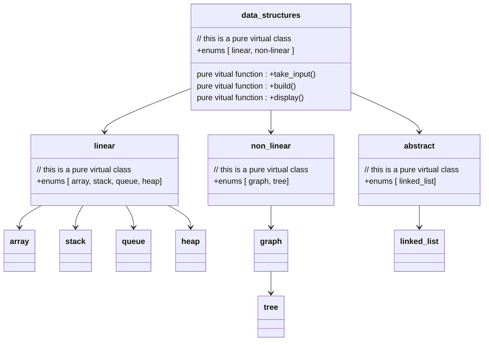

# Project Vizualization
A tool to help vizualize the representation of data structures
in computer memory.

### Graphs

```mermaid

  classDiagram

    data_structures --> linear
    data_structures --> non_linear
    data_structures --> abstract

    linear --> array
    linear --> stack
    linear --> queue
    linear --> heap

    non_linear --> graph
    graph --> tree
    
    abstract --> linked_list

class data_structures{
    // this is a pure virtual class
    +enums [ linear, non-linear ]
    
    
    pure vitual function : +take_input() 
    pure vitual function : +build() 
    pure vitual function : +display()    
  }
  
class linear{
// this is a pure virtual class
+enums [ array, stack, queue, heap]

}

class non_linear{
// this is a pure virtual class
+enums [ graph, tree]

}

class abstract{
// this is a pure virtual class
+enums [ linked_list]

}


```

